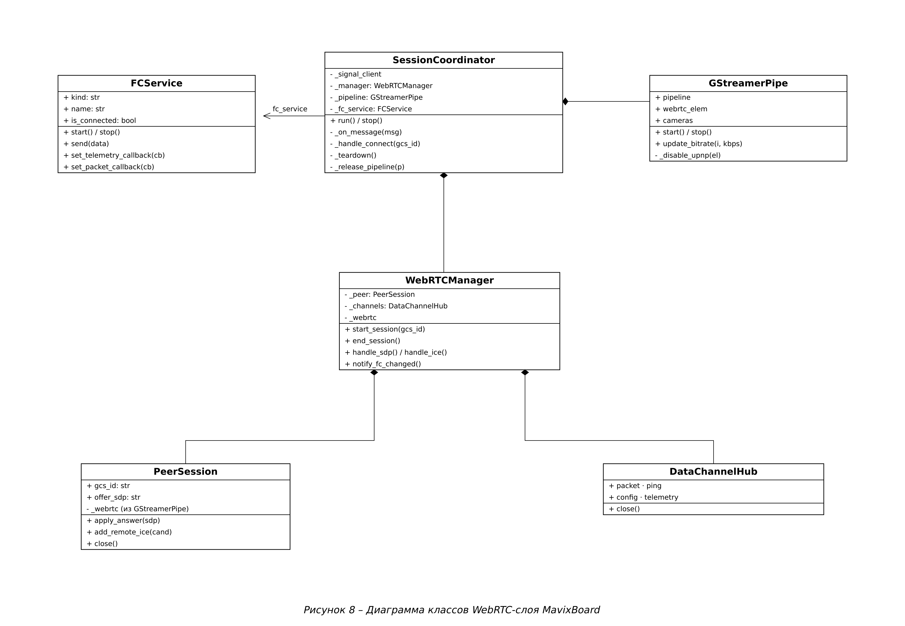
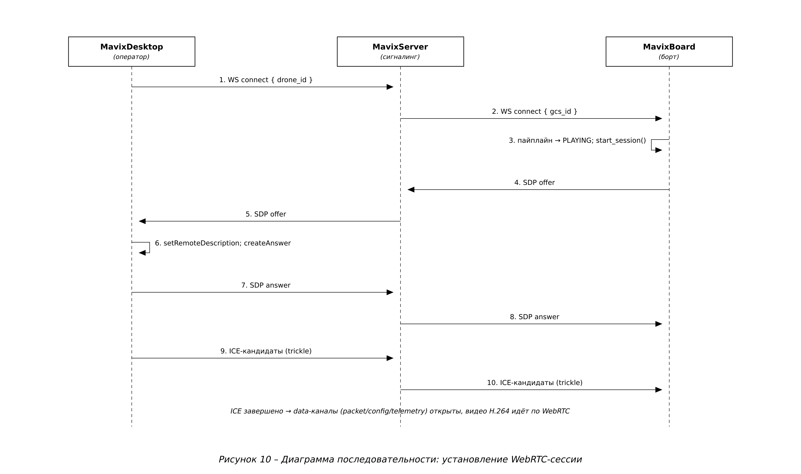
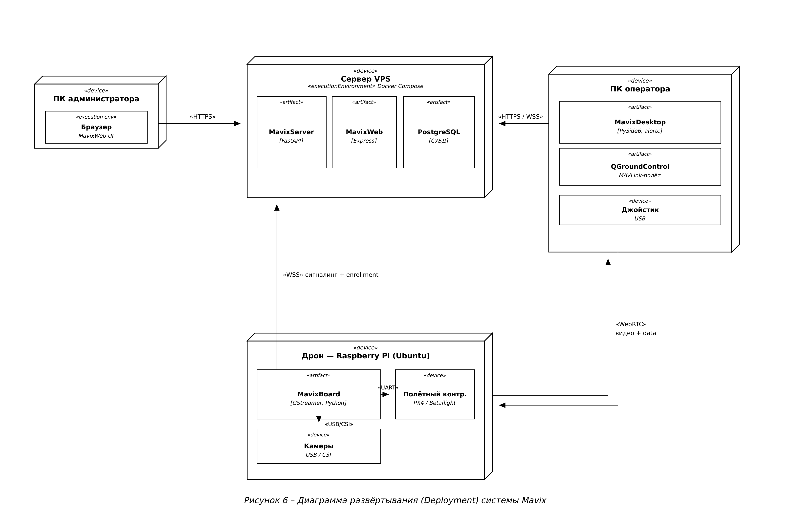

# MavixBoard — Техническое описание

Документ составлен по ГОСТ 19.402-78 «Описание программы» (ЕСПД).

## 1. Аннотация

MavixBoard — бортовая часть системы доставки грузов дронами Mavix, работающая на
Raspberry Pi. Стримит видео с камер оператору по WebRTC, принимает команды
управления по data-каналу и пробрасывает их на полётный контроллер (CRSF или
MAVLink), отдаёт телеметрию (GPS/курс/батарея), исполняет сброс груза (AUX-канал)
и самостоятельно регистрируется на сервере (enrollment).

## 2. Общие сведения

- **Наименование:** MavixBoard.
- **Стек:** Python 3.12, GStreamer (`webrtcbin`, libnice), PyGObject, asyncio,
  websockets; ОС — Ubuntu на Raspberry Pi.
- **Связь:** WebSocket-сигналинг с MavixServer; WebRTC P2P (видео + data-каналы)
  с MavixDesktop; UART/USB — с полётным контроллером.

## 3. Функциональное назначение

- Захват видео с камер (USB/CSI), кодирование H.264, передача по WebRTC.
- Приём RC-команд по packet-каналу, проброс на FC (CRSF 420000 бод / MAVLink).
- Декодирование телеметрии FC (GPS, курс, батарея) и отправка оператору.
- Сброс груза по AUX-каналу (CH8) и уведомление.
- Самостоятельная регистрация (enrollment) по ADMIN_ID + ENROLLMENT_TOKEN,
  генерация DRONE_ID и сохранение идентичности в env.

## 4. Описание логической структуры

`SessionCoordinator` владеет жизненным циклом сессии: создаёт `GStreamerPipe`
(пайплайн `webrtcbin`), `WebRTCManager` (сессия), который композирует
`PeerSession` (сигналинг offer/answer/ICE) и `DataChannelHub` (каналы
packet/ping/config/telemetry); `FCService` — связь с полётным контроллером.

`CameraCalibrator.calibrate` проверяет режимы камеры не полным перебором всех
разрешений, а на representative-выборке: всегда берутся минимальное и
максимальное разрешение (по площади) плюс равномерно распределённые «середины»
в количестве `round(R*0.4 − 2)`, где `R` — число уникальных разрешений (см.
`_select_resolution_indices`). Внутри каждого выбранного разрешения все его fps
пробуются GStreamer-конвейером как прежде. Это кратно сокращает число проб (для
10 разрешений калибруются индексы `0, 3, 6, 9`) и заметно ускоряет калибровку
на камерах с большим числом режимов.



Установление сессии (offer/answer/ICE через сервер):



Размещение борта в системе:



## 5. Используемые технические средства

Raspberry Pi (Ubuntu), GStreamer с плагинами (base/good/bad/ugly/libav/nice/
libcamera), Python 3.12 + PyGObject. Полётный контроллер (Betaflight/iNav/
ArduPilot/PX4), камеры USB/CSI. Подробная подготовка железа, UART и **прав на
порты** — [HARDWARE_SETUP.md](HARDWARE_SETUP.md).

## 6. Установка и настройка

1. Подготовить RPi, UART и FC по [HARDWARE_SETUP.md](HARDWARE_SETUP.md).
2. Поставить системные GStreamer-зависимости (там же, §1.6) и Python-пакеты.
3. В env задать `ADMIN_ID` и `ENROLLMENT_TOKEN` (из кабинета администратора).
   При первом запуске борт регистрируется и дописывает `DRONE_ID`/`DRONE_TOKEN`.
4. Автозапуск — systemd-юнит (см. HARDWARE_SETUP §1.8), группы `dialout video`.

## 7. Проверка работы

```bash
python -m pytest -q        # полный набор тестов борта — зелёный
python3 -m fc              # диагностика FC: тип, имя, пакеты/сек
```

## 8. Сообщения системному программисту

- `Namespace GstWebRTC not available` → не установлен `gir1.2-gst-plugins-bad-1.0`.
- Нет offer от борта → проверить `latency=0` на `webrtcbin` до `PLAYING`.
- RXLOSS / FC не армится → провода TX↔RX, `disable-bt`, права на порт — см. HARDWARE_SETUP §3.
- Нет relay-кандидатов → проверить TURN (формат URL, креды) — см. WEBRTC_TURN_NOTES.

## 9. Журналирование

Логи (stdout + файл) с префиксами `[coord]`, `[manager]`, `[peer]`, `[gst]`,
`[ice]`, `[transmit]`, `[mavlink]`. Человекочитаемый текст — на русском.

## 10. Сложности и принятые решения

- **Дедлок при teardown (gupnp-igd).** Финальный unref `webrtcbin` освобождал
  ICE-агент libnice, чей финализатор gupnp-igd (UPnP) вставал в `g_cond_wait` без
  таймаута — на потоке asyncio-loop весь борт зависал. Решение: отключаем UPnP в
  ICE-агенте и изолируем разбор пайплайна в отдельный daemon-поток
  (`gstreamer.py::_disable_upnp`, `coordinator.py::_release_pipeline`).
- **Совместимость aiortc ↔ webrtcbin и TURN/ICE** (trickle-кандидаты, relay_patch,
  force_relay, DTLS `setup:passive`) — подробный разбор в
  [WEBRTC_TURN_NOTES.md](WEBRTC_TURN_NOTES.md).
- **GPS без фикса.** Полётник до захвата спутников шлёт нулевые координаты
  (0°,0°). `_forward_telemetry` не пробрасывает такую позицию (иначе дрон
  «телепортируется» в океан); по числу спутников гейтить нельзя — MAVLink
  `GLOBAL_POSITION_INT` его не несёт.
- **GLib + asyncio.** Bus-watch и сигналы `webrtcbin` срабатывают только при
  работающем `GLib.MainLoop` — он крутится в отдельном daemon-потоке
  (`core/glib_loop.py`).

## 11. Принципы проектирования (SOLID / DRY / KISS / YAGNI)

Примеры из кода MavixBoard.

- **S — единственная ответственность.** `GStreamerPipe` — только пайплайн
  (start/stop/bitrate), `WebRTCManager` — жизненный цикл сессии, `PeerSession` —
  сигналинг offer/answer/ICE, `DataChannelHub` — data-каналы, `FCService` — связь
  с полётным контроллером.
- **O — открытость/закрытость.** Поддержка протоколов FC: `fc/detect.py`
  определяет тип, `fc/crsf.py` и `fc/mavlink.py` — независимые декодеры за общим
  контрактом «вернуть унифицированный dict телеметрии». Новый протокол = новый
  модуль-декодер, координатор не меняется.
- **L — подстановка Лисков.** CRSF- и MAVLink-декодеры взаимозаменяемы за общим
  контрактом; `CameraSource` (реестр камер) подставляется в координатор любой
  реализацией.
- **I — разделение интерфейсов.** `DataChannelHub` отдаёт каналы
  `packet`/`ping`/`config`/`telemetry` по отдельности — потребитель берёт только нужный.
- **D — инверсия зависимостей.** `SessionCoordinator.__init__` получает
  `signal_client`, `pipeline_factory`, `fc_service`, `watcher`, `camera_source`
  извне (внедрение), а не создаёт их сам — упрощает тесты и замену реализаций.
- **DRY.** Переотправка и переподключение опираются на общий
  `core/backoff.py::ExponentialBackoff`; объединение GPS- и ATTITUDE-кадров в одну
  телеметрию — единый `_forward_telemetry`.
- **KISS.** Параметры камеры (разрешение/FPS) зашиты в caps пайплайна; смена —
  простая пересборка пайплайна при переподключении, без сложной динамической
  переконфигурации работающего `webrtcbin`.
- **YAGNI.** Из потока FC декодируется только реально используемая телеметрия
  (GPS/курс/батарея/heartbeat), остальное игнорируется — без «на всякий случай».
